# LangLearner

LangLearner is the repository name for **LinguaDecks**, an Expo + React
Native mobile application for learning vocabulary with custom decks, Gemini
translation, Firebase authentication, Firestore cloud sync, offline-first local
state, and quiz-based review.

This project is intentionally documented and presented as a **mobile app**.
Desktop screenshots were removed from the documentation because the delivery
target is the Android/iOS mobile experience.

## What The App Does

- Creates Firebase email/password accounts, signs users in and out, and protects
  every main route behind an auth gate.
- Stores the active Firebase session in SecureStore so the user does not need
  to log in after every app restart.
- Lets the user create vocabulary decks with an optional cover image from the
  device gallery.
- Lets the user add, edit, and delete vocabulary cards inside each deck.
- Uses Gemini to auto-translate a word into the selected target language when
  an API key is configured.
- Persists decks, cards, settings, auth state, and sync metadata locally through
  Redux Persist + AsyncStorage.
- Syncs user-scoped deck/card data to Firestore through the Firestore REST API.
- Queues local deck/card changes while offline and replays the queue when the
  connection returns.
- Shows an app-level offline banner when the device or browser preview is
  offline.
- Provides a quiz flow with answer reveal, known/practice scoring, swipe
  gestures, and a result summary.
- Supports English and Turkish UI text through i18next.
- Supports light and dark themes from the profile/settings screen.
- Supports local daily study reminders through Expo Notifications.
- Adds haptic feedback to important study/settings actions on supported devices.

## Mobile Screenshots

All screenshots below are mobile viewport captures. They cover the auth,
deck, card, Gemini, quiz, sync/settings, language/theme, offline, and logout
flows.

| Login | Register |
| --- | --- |
| 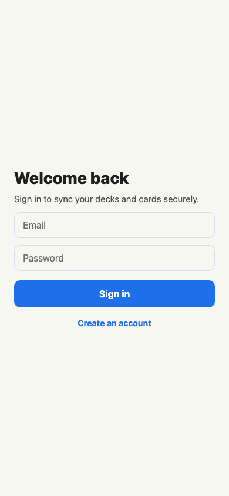 | 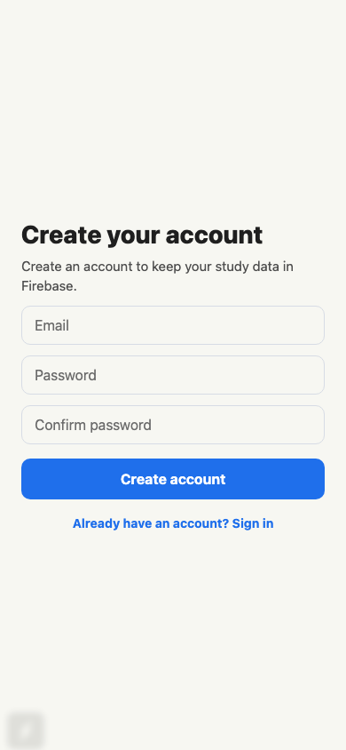 |

| Home | Empty deck list |
| --- | --- |
| 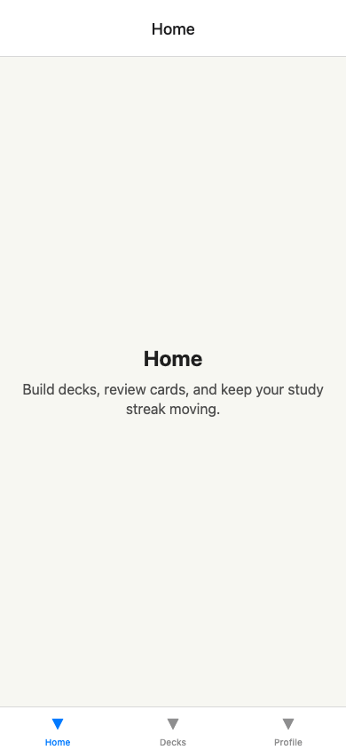 |  |

| Create deck modal | Deck list |
| --- | --- |
| 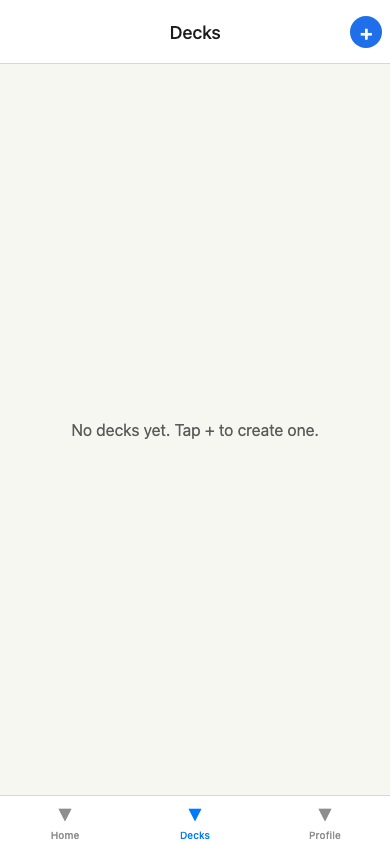 | 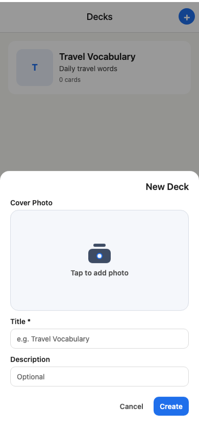 |

| Empty deck detail | Add card modal |
| --- | --- |
| 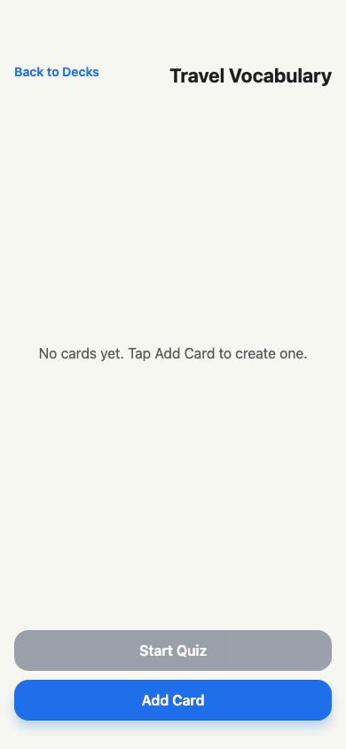 | 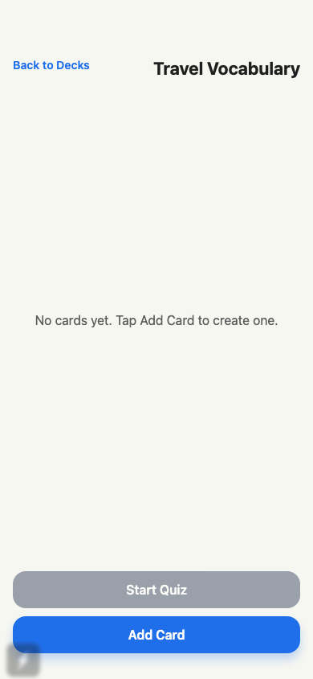 |

| Gemini auto-translate | Card list |
| --- | --- |
| 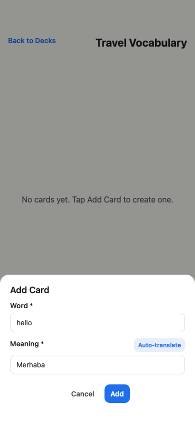 | 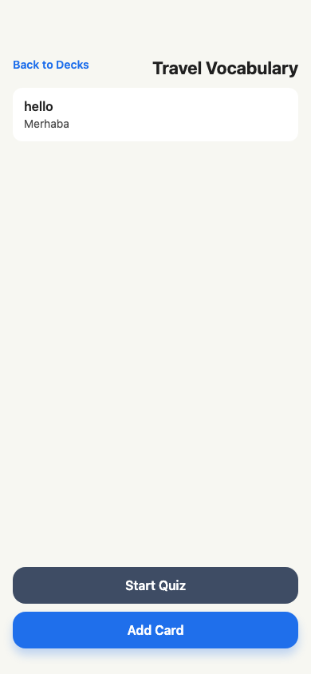 |

| Edit card modal | Edited card list |
| --- | --- |
| 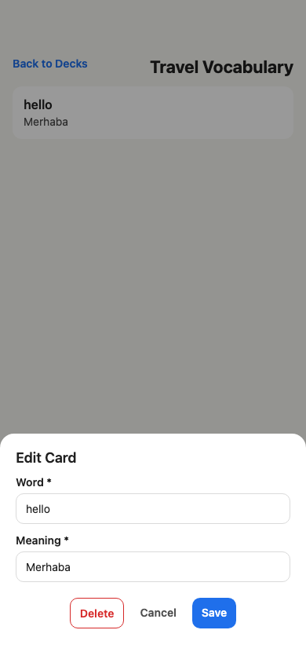 |  |

| Quiz question | Quiz answer |
| --- | --- |
| 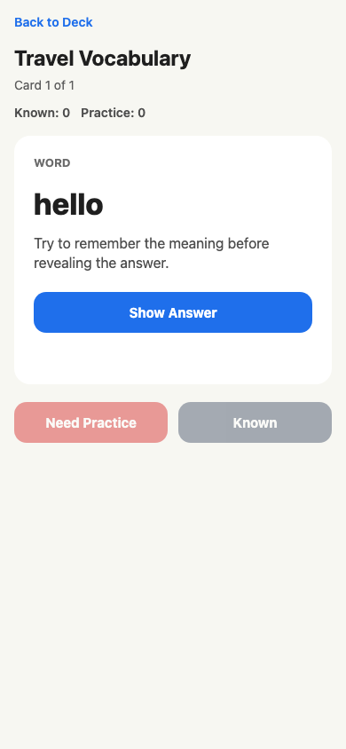 | 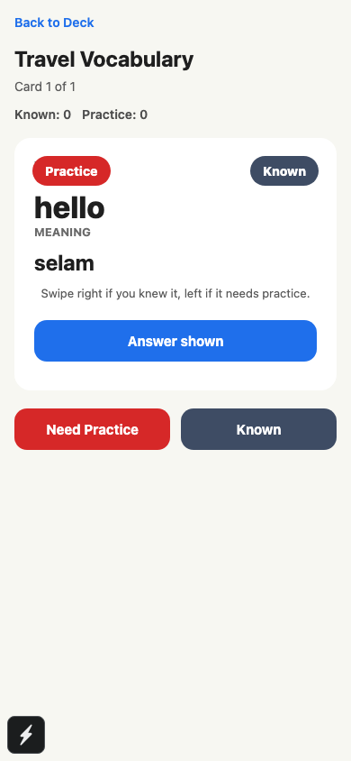 |

| Quiz result | Profile sync/settings |
| --- | --- |
|  | 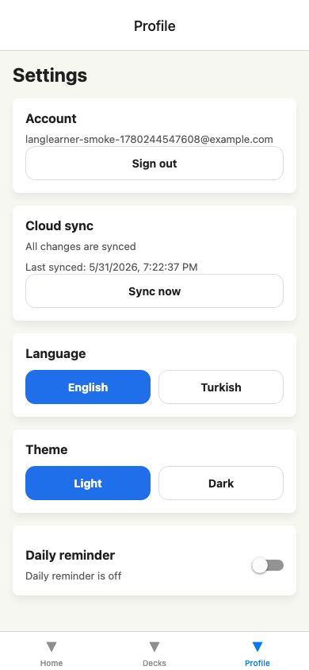 |

| Turkish language | Dark theme |
| --- | --- |
| 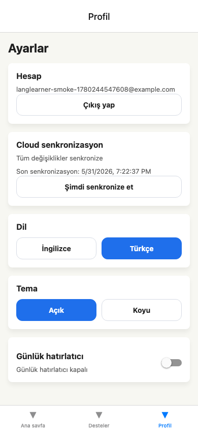 | 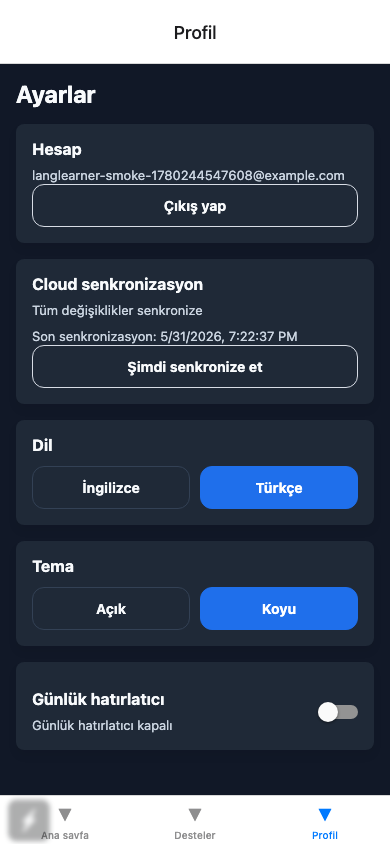 |

| Offline banner | Logout/login protection |
| --- | --- |
| 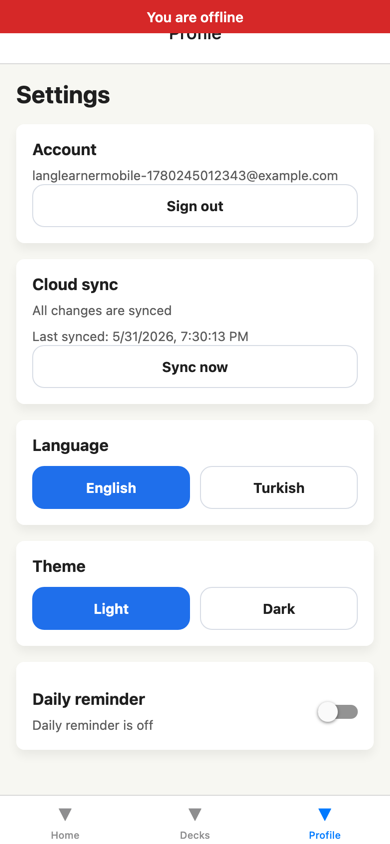 | 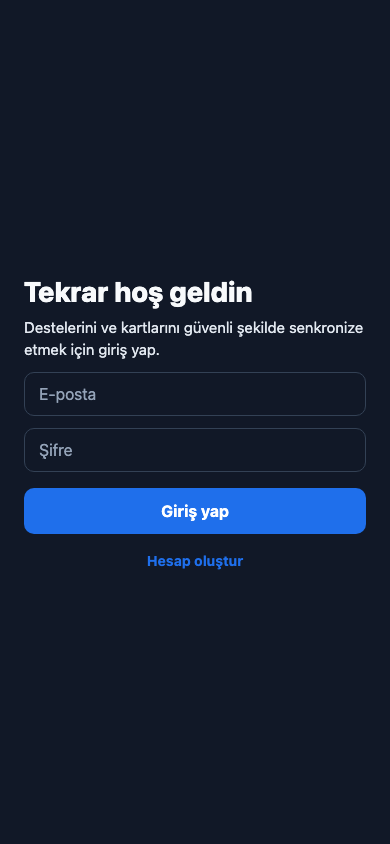 |

## Tech Stack

- Expo SDK 54 and React Native 0.81.
- Expo Router for file-based navigation and protected route layout.
- TypeScript with strict type checking.
- Redux Toolkit for application state.
- redux-persist + AsyncStorage for local persistence.
- Expo SecureStore for persisted auth session tokens.
- Firebase Auth REST API for email/password login and registration.
- Firestore REST API for user-scoped cloud persistence.
- Gemini REST API for auto-translation.
- @react-native-community/netinfo for native network state.
- Browser `navigator.onLine` fallback for web preview/offline QA.
- expo-image-picker for deck cover photos.
- expo-notifications for daily reminder scheduling.
- expo-haptics for tactile feedback on supported devices.
- react-native-gesture-handler and react-native-reanimated for quiz gestures.
- i18next + react-i18next for English/Turkish localization.
- Jest + jest-expo + Testing Library for unit/component tests.
- GitHub Actions CI for install, lint, typecheck, and Jest.

## Architecture

The app is split by responsibility so each part is easy to explain during a
presentation:

- `app/` contains Expo Router screens: auth, tabs, deck detail, quiz, and result
  routes.
- `app/_layout.tsx` is the root app shell. It mounts Redux, persisted state,
  error handling, gesture support, auth protection, cloud sync, route rendering,
  and the offline banner.
- `src/components/` contains reusable UI such as cards, modals, auth guards,
  error boundaries, and the offline banner.
- `src/hooks/` contains UI-facing logic for auth, decks, cards, settings, quiz,
  image picking, network status, and cloud sync.
- `src/store/` contains Redux slices for auth, deck/card data, settings, and
  sync queue state.
- `src/services/` contains external boundaries: Gemini, Firebase Auth,
  Firestore, notifications, haptics, and storage helpers.
- `src/localization/` contains English and Turkish translation resources.
- `src/utils/` contains testable helpers for validation, IDs, and quiz results.
- `__tests__/` contains focused tests for reducers, hooks, services, components,
  validation helpers, auth, translation, notifications, network status, and
  error boundaries.

## Data Flow

1. The user signs in or registers through Firebase Auth REST endpoints.
2. Auth tokens are saved locally through SecureStore and mirrored in Redux.
3. Deck/card actions update Redux immediately so the UI stays responsive.
4. Redux Persist writes the latest state to AsyncStorage for offline startup.
5. Mutating deck/card actions are added to the sync queue.
6. `CloudSyncController` watches auth + network state and calls cloud sync when
   the user is signed in and online.
7. Firestore writes are scoped under the active Firebase UID.
8. If the device is offline, the queue remains local and is replayed later.

Firestore document paths:

```text
users/{firebaseUid}/decks/{deckId}
users/{firebaseUid}/decks/{deckId}/cards/{cardId}
```

## Setup

Install dependencies:

```sh
npm ci
```

Create `.env` from `.env.example`:

```sh
EXPO_PUBLIC_GEMINI_API_KEY=your_gemini_api_key
EXPO_PUBLIC_FIREBASE_API_KEY=your_firebase_web_api_key
EXPO_PUBLIC_FIREBASE_PROJECT_ID=your_firebase_project_id
```

Start the project:

```sh
npm start
```

Run on mobile:

```sh
npm run android
npm run ios
```

The project also has a web preview script for development convenience, but the
documented product target is mobile.

## Firebase Setup

Firebase needs these project features enabled:

- Authentication with the Email/password provider.
- Cloud Firestore.
- A Firebase Web App so the Web API key and project id can be copied into
  `.env`.
- Published Firestore security rules from `firestore.rules`.

Deploy rules:

```sh
firebase login
firebase use your_firebase_project_id
firebase deploy --only firestore:rules
```

The app does not depend on the Firebase JavaScript SDK at runtime. It uses the
REST APIs directly, which keeps the mobile bundle smaller and makes service
tests easier to mock.

## Gemini Setup

Gemini auto-translation uses:

```sh
EXPO_PUBLIC_GEMINI_API_KEY=your_gemini_api_key
```

If the key is missing, the app does not crash. The auto-translate button is
disabled and the user sees a configuration warning instead of a failed network
request.

## Packages

No screenshot-generation or desktop-testing package is required by the project.
The committed dependency set is only for the app, local quality checks, and unit
tests.

Notable package choices:

- Redux Toolkit is used for predictable immutable state updates.
- redux-persist + AsyncStorage keeps study data available offline.
- SecureStore is used for auth tokens instead of plain AsyncStorage.
- NetInfo is used for native network state, with a browser fallback only for
  Expo web preview/offline QA.
- Expo Notifications, Image Picker, Haptics, and Router are first-party Expo
  packages aligned with the Expo SDK.
- Jest and Testing Library cover logic and component behavior without adding an
  E2E framework to the committed project.

## EAS Preview Build And Release

`eas.json` includes a `preview` Android APK profile:

```sh
npx eas-cli build --platform android --profile preview
```

Before the build, log in and add EAS environment variables:

```sh
npx eas-cli login
npx eas-cli env:create preview --name EXPO_PUBLIC_GEMINI_API_KEY --value your_gemini_api_key --visibility sensitive
npx eas-cli env:create preview --name EXPO_PUBLIC_FIREBASE_API_KEY --value your_firebase_web_api_key --visibility sensitive
npx eas-cli env:create preview --name EXPO_PUBLIC_FIREBASE_PROJECT_ID --value your_firebase_project_id --visibility plaintext
```

Release process after the APK exists:

```sh
gh release create v1.0.0 path/to/app-preview.apk \
  --title "LangLearner v1.0.0" \
  --notes "Mobile preview build for the language learner app."
```

Current machine status: the source code and `eas.json` are ready for an Android
preview build, but this machine still needs an Expo/EAS login or `EXPO_TOKEN`.
A local Android build also needs Java and Android SDK tooling installed.

## Quality Checks

Run these before submitting or presenting:

```sh
npm run lint
npm run typecheck
npm test -- --runInBand
npm test -- --coverage --runInBand
npx expo-doctor
```

The GitHub Actions workflow in `.github/workflows/ci.yml` runs:

- `npm ci`
- `npm run lint`
- `npm run typecheck`
- `npm test -- --runInBand`

Current local verification on May 31, 2026:

- `npm run lint`: passed.
- `npm run typecheck`: passed.
- `npm test -- --coverage --runInBand`: passed, 54/54 tests, 86.74% line
  coverage.
- `npm audit --audit-level=high`: passed for high/critical findings; npm still
  reports moderate Expo dependency-chain advisories that require a breaking Expo
  upgrade to resolve automatically.
- `npx expo-doctor`: passed, 18/18 checks.
- `npx expo export --platform web --output-dir /tmp/langlearner-export-test`:
  passed.
- `npx eas-cli whoami`: blocked with `Not logged in`.
- `java -version`: blocked because no Java runtime is installed on this
  machine.

## Manual QA Flow

Use this exact flow for a class presentation:

1. Register with email/password.
2. Confirm the app opens the protected tab area after registration.
3. Go to Decks and create a deck.
4. Open the deck detail screen.
5. Add a card manually.
6. Use Gemini auto-translate for a word and show the generated meaning.
7. Edit the card and save the updated meaning.
8. Start a quiz from the deck.
9. Reveal the answer and mark the card known/practice.
10. Show the quiz result screen.
11. Open Profile and show cloud sync status.
12. Switch language from English to Turkish.
13. Switch theme from light to dark.
14. Turn the network off and show the offline banner.
15. Sign out and confirm the app returns to the login screen.

## External Accounts Needed

- Firebase project with Auth and Firestore enabled.
- Gemini API key.
- Expo account or `EXPO_TOKEN` for EAS preview builds.
- GitHub repository permissions for pushing commits and publishing releases.

## Notes

Firebase Auth, Firestore sync, Gemini translation, offline queueing, SecureStore
session storage, CI, EAS preview configuration, and mobile screenshot
documentation are implemented. The only remaining external step for a release
asset is running EAS with valid Expo credentials and attaching the resulting APK
to a GitHub Release.
