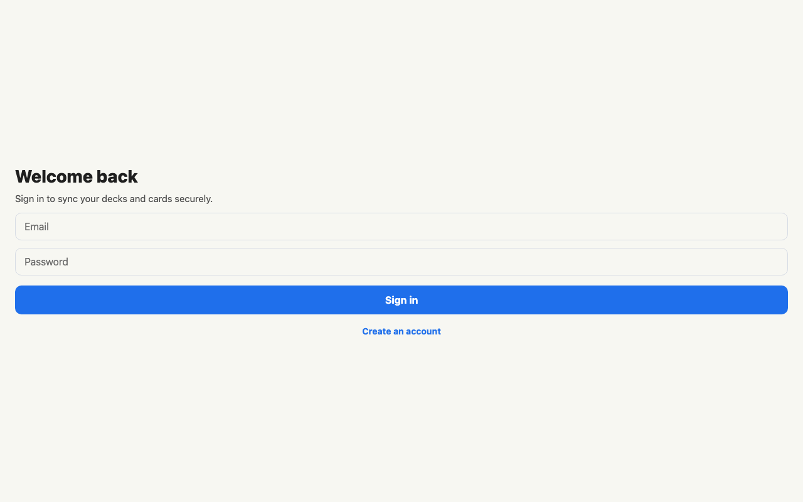
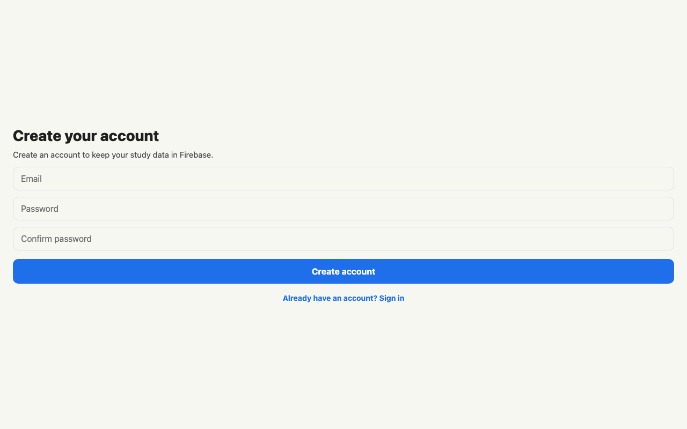

# LangLearner

LangLearner is an Expo + React Native mobile app for building vocabulary decks, adding word cards, translating words with Gemini, syncing study data through Firebase, and studying with a quiz flow.

## Features

- Register, sign in, sign out, and protect the main app behind Firebase Auth.
- Create, edit, and delete vocabulary decks.
- Add, edit, and delete cards inside each deck.
- Persist decks/cards on-device with Redux Persist and AsyncStorage.
- Sync decks/cards to user-scoped Firestore documents with an offline queue.
- Auto-translate card meanings through the Gemini REST API.
- Add deck cover photos from the device gallery.
- Study cards with a quiz flow, animated card reveal, swipe gestures, scoring, and result summary.
- Show offline status with NetInfo.
- Schedule a local daily study reminder with Expo Notifications.
- Provide haptic feedback for quiz and settings actions.
- Switch the app language between English and Turkish.
- Switch between light and dark themes from settings.

## Screenshots

| Mobile login | Mobile register |
| --- | --- |
|  |  |

| Desktop login | Desktop register |
| --- | --- |
|  |  |

## Tech Stack

- Expo SDK 54
- React Native 0.81
- TypeScript
- Expo Router
- Redux Toolkit
- redux-persist + AsyncStorage
- Firebase Auth REST API + Firestore REST API
- Expo SecureStore
- react-native-gesture-handler
- react-native-reanimated
- expo-image-picker
- expo-notifications
- expo-haptics
- i18next + react-i18next
- Jest + jest-expo

## Setup

Install dependencies:

```sh
npm ci
```

Create a `.env` file:

```sh
EXPO_PUBLIC_GEMINI_API_KEY=your_gemini_api_key
EXPO_PUBLIC_FIREBASE_API_KEY=your_firebase_web_api_key
EXPO_PUBLIC_FIREBASE_PROJECT_ID=your_firebase_project_id
```

Start the app:

```sh
npm start
```

Run on Android or iOS:

```sh
npm run android
npm run ios
```

## Firebase Setup

Create a Firebase project, then enable:

- Authentication: Email/password provider.
- Cloud Firestore: production mode, then publish `firestore.rules`.
- Web app credentials: copy the Web API key and project id into `.env`.

Deploy the included rules after installing Firebase CLI:

```sh
firebase login
firebase use your_firebase_project_id
firebase deploy --only firestore:rules
```

The app stores auth refresh/id tokens in SecureStore. Firestore documents are scoped under:

```text
users/{firebaseUid}/decks/{deckId}
users/{firebaseUid}/decks/{deckId}/cards/{cardId}
```

## EAS Preview Build

Create or log into an Expo account, then connect this project to EAS:

```sh
npx eas-cli login
npx eas-cli init
```

Add the public runtime variables to EAS environments:

```sh
npx eas-cli env:create preview --name EXPO_PUBLIC_GEMINI_API_KEY --value your_gemini_api_key --visibility sensitive
npx eas-cli env:create preview --name EXPO_PUBLIC_FIREBASE_API_KEY --value your_firebase_web_api_key --visibility sensitive
npx eas-cli env:create preview --name EXPO_PUBLIC_FIREBASE_PROJECT_ID --value your_firebase_project_id --visibility plaintext
```

Build an Android preview APK:

```sh
npx eas-cli build --platform android --profile preview
```

Current EAS status: `eas.json` has a preview APK profile, but this machine is
not logged into an Expo account. Run `npx eas-cli login` or set `EXPO_TOKEN`
before starting the remote preview build.

## Quality Checks

```sh
npm run lint
npm run typecheck
npm test -- --runInBand
```

Current local verification:

- `npm run lint` passes.
- `npm run typecheck` passes.
- `npm test -- --runInBand` passes with 50 tests.
- `npx expo-doctor` passes all checks.
- `npx expo export --platform web --output-dir /tmp/langlearner-export-test` passes.

## Demo Flow

Use this path for a quick project presentation:

1. Open the app in Expo Go.
2. Register or sign in with email/password.
3. Go to Decks and create a vocabulary deck.
4. Open the deck and add a card.
5. Use Auto-translate to fill the card meaning, then save it.
6. Turn the network off, edit a card, then reconnect and use Sync now.
7. Start a quiz from the deck detail screen.
8. Reveal the answer, then swipe right for known or left for practice.
9. Review the quiz result screen.
10. Open Settings and switch between English/Turkish.
11. Switch between light/dark theme.
12. Toggle the daily reminder and show permission handling.

## Final Local QA Checklist

Run these checks before presenting or submitting:

- `npm run lint`
- `npm run typecheck`
- `npm test -- --runInBand`
- `npx expo-doctor`
- `npx expo start --clear`
- Expo Go smoke test on a physical device.
- Small-screen and large-screen visual pass.
- Deck create/edit/delete flow.
- Card create/edit/delete flow.
- Quiz, result, language, theme, reminder, and offline banner checks.
- Register/login/logout and route protection checks.
- Firestore create/edit/delete and offline queue replay checks.
- Android EAS preview build once Expo credentials are available.

## Project Structure

- `app/`: Expo Router routes, tabs, deck detail, quiz, and result screens.
- `src/components/`: reusable modal, card, row, and banner UI.
- `src/hooks/`: Redux-facing hooks, quiz state, image picker, network status, and settings.
- `src/store/`: Redux store and persisted slices.
- `src/services/`: Gemini translation, Firebase Auth, Firestore sync, haptics, and local notification services.
- `src/localization/`: English and Turkish i18n resources.
- `src/utils/`: testable validation and quiz result helpers.
- `__tests__/`: reducer, validation, quiz result, notification, translation, auth, and error boundary tests.
- `.github/workflows/ci.yml`: GitHub Actions CI for install, lint, typecheck, and Jest.

## Notes

Firebase Auth, Firestore, offline sync queue, SecureStore session storage, and EAS preview configuration are implemented. A real Firebase project, Firebase rules deployment, Expo account, and EAS build run are still external account steps.
